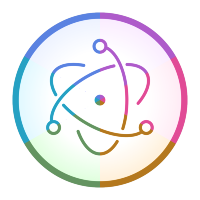

## Modern cross platform GUI desktop app based on node and python

<br>

<p>
  Electron React and Flask Api <a href="https://electron.atom.io/">Electron</a>, <a href="https://facebook.github.io/react/">React</a>, <a href="https://github.com/reactjs/redux">Redux</a>, <a href="https://github.com/reactjs/react-router">React Router</a>, <a href="https://flask.palletsprojects.com/en/1.1.x/">Flask</a>Build A Powerfull Cross Platfrom Desktop app 
</p>

<br>

<div align="center">
  <a href="https://facebook.github.io/react/"></a>

  <a href="https://www.electronjs.org/"></a>

  <a href="https://www.python.org/doc/"></a>

</div>

<hr />
<br />


## Previews


## Features

Front end **React Js**

Backend **Flask api**

App Base **Elctron js**

## App Features

Api login authentication **( jwt basic authentication)**

After login you  got - **[Coreui Dashbord ](https://coreui.io/react/)**

## Install

- **If you have installation or compilation issues with this project, please see [Contact on me Facebook ](https://www.facebook.com/samu.sarkar2)**

First, clone the repo via git or download as zip:

```bash
git clone https://github.com/spiderwave/React-Electron-Python.git
cd React-Electron-Python 

```

Then , Install React-elctron boilerplat dependencies:

```bash

cd gui

npm install

```


Then , Install python dependencies:
```bash
cd ..
cd engine 
pip install -r requaments.txt

```

or 

```bash
pip install pipenv

```

## To start this project :
Fast you hav to run Flask app (backhand server) then run elctron-react-boilerplate 

To do this :

Fast,
```bash

cd engine 

python app.py

``` 
Then, 
```bash

cd gui  

npm run start

``` 


## Packaging for Production


- **[Contact on me Facebook ](https://www.facebook.com/samu.sarkar2)**


## Donations

**Donations will ensure the following:**

- 🔨 Long term maintenance of the project

- 🐛 To create more easy this project and build new freamwork the most powerfull (nodejs , python)  mordern desktop app


## Maintainers

- [Pranab](https://github.com/spiderwave)


